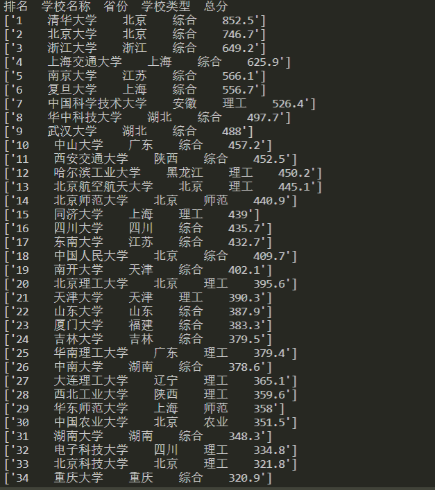
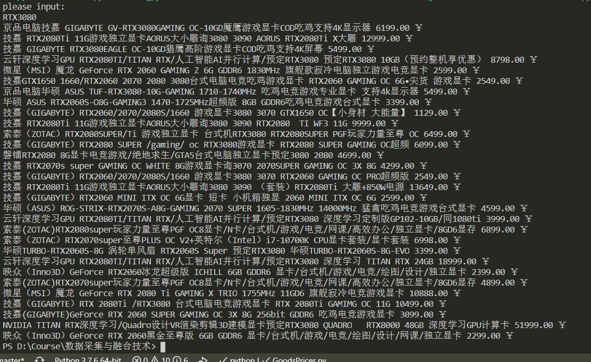

## 数据采集与融合技术第一次作业
### 第一题
#### 题目
要求：用requests和BeautifulSoup库方法定向爬取[给定网址](http://www.shanghairanking.cn/rankings/bcur/2020)的数据，屏幕打印爬取的大学排名信息。
#### 解答
主要就是BS的基本使用
##### code:
```
import requests,bs4
url = "http://www.shanghairanking.cn/rankings/bcur/2020"
soup = bs4.BeautifulSoup(requests.get(url).content.decode(),"html.parser")
information = []
for child in soup.find("tbody").children:
    res = child.find_all("td")
    information.append([res[0].text.strip() + "    " + res[1].text.strip() + "    " + res[2].text.strip() + "    " +
                        res[3].text.strip() + "    " + res[4].text.strip()])
print("排名  学校名称  省份  学校类型  总分")
for info in information:
    print(info)
```
##### result

### 第二题
#### 题目
要求：用requests和re库方法设计某个商城（自已选择）商品比价定向爬虫，爬取该商城，以关键词“书包”搜索页面的数据，爬取商品名称和价格。
#### 解答
选择京东商城，爬书包太没劲了，故选择关键词为“**RTX3080**”。
##### code
```
## 并不完善的一份代码，暂时不支持中文搜索

from urllib.request import urlopen
from bs4 import BeautifulSoup
import re

print("please input:")
item = input()
url = 'https://search.jd.com/Search?keyword='+item ##这玩意好像每天都在变
html = urlopen(url)
bs = BeautifulSoup(html,'html.parser')
goods = bs.find_all("li",{"data-sku":re.compile("\d+")})
for good in goods:
    # print(good.get_text())
    # print(good)
    good_info = good.find("div",{"class":"p-name p-name-type-2"}).find('em').get_text()
    # print(good_info)
    price = good.find('div',{'class':'p-price'}).strong.i.get_text()
    print(good_info.replace("\n","").replace("\t",""),price,"￥")
```
##### result


### 第三题
#### 题目
要求：爬取[一个给定网页](http://xcb.fzu.edu.cn/html/2019ztjy)或者自选网页的所有JPG格式文件。
#### 解答
查看具体网址的源代码后发现，主要的图片都在content内部，故使用BeautifulSoup4中的find_all函数在content内搜索图片路径。
图片路径包括内链接（以“/...”开头，是给定网站内部的图片）与外链接（以“HTTP...”开头，是其他网站的图片），故对两种图片链接分类处理。
得到所有图片的链接后，使用`requests.get()`获取图片数据。
##### code
```
from urllib.request import urlopen
from bs4 import BeautifulSoup
# from urllib import urlretrieve
import requests

url = 'http://xcb.fzu.edu.cn/'
html = urlopen(url)
bs = BeautifulSoup(html,'html.parser')
name = 1
for imgs in bs.find('div',{'class':'content'}).find_all('img'):
    # if 'src' in imgs.attrs:
    #     print(imgs)
    img = imgs['src']
    if img[-3:] != 'gif':
        if img[:4] == 'http':
            path = img
        else:
            path = url+img
    else:
        continue
    print(path)
    # img_data = urlopen(path)
    # img_data = img_data.read()
    img_file = requests.get(path).content
    with open("Object1：爬取学生信息\images/"+str(name)+".jpg","wb") as f:
        f.write(img_file)
        f.close()
        print(name,"over")
        name += 1
```
##### result
