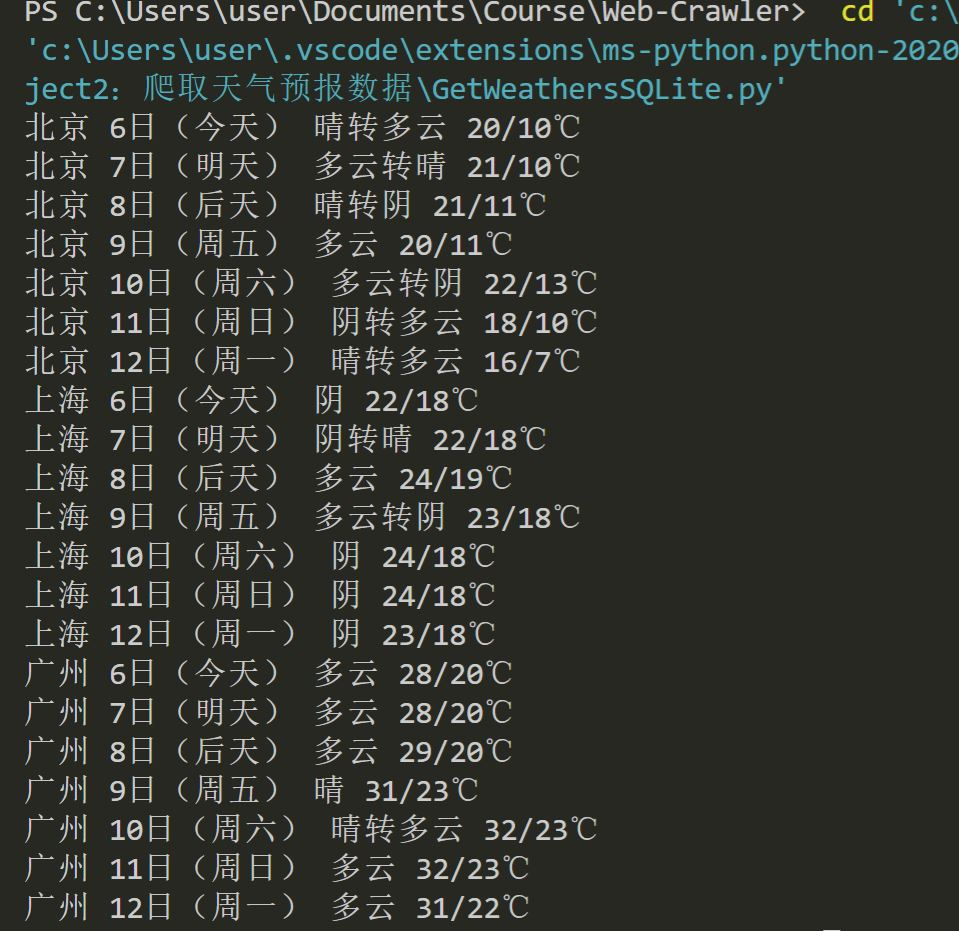
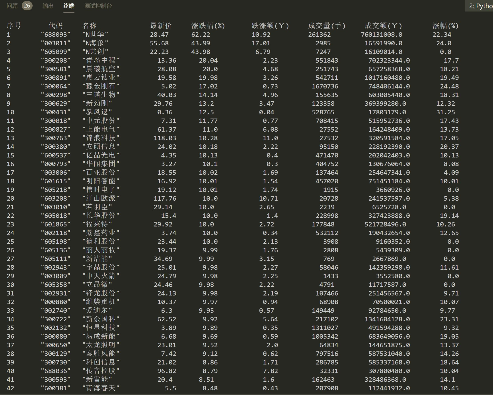
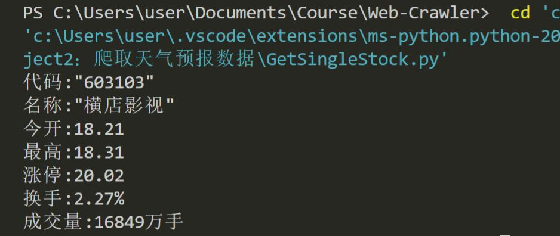

# 第一题
## 要求
在[中国气象网](http://www.weather.com.cn)给定城市集的7日天气预报，并保存在数据库。
## 思路
- 解析网站源码与架构
- 用BeautifulSoup解析出所需的信息
- 将数据保存在数据库（SQLite）
## code
```
from bs4 import BeautifulSoup
from bs4 import UnicodeDammit
import urllib.request
import sqlite3

class WeatherDB: ##database

    def openDB(self):
        self.con=sqlite3.connect("weathers.db")
        self.cursor=self.con.cursor()
        try:
            self.cursor.execute("create table weathers (wCity varchar(16),wDate varchar(16),wWeather varchar(64),wTemp varchar(32),constraint pk_weather primary key (wCity,wDate))")
        except:
            self.cursor.execute("delete from weathers")

    def closeDB(self):
        self.con.commit()
        self.con.close()

    def insert(self,city,date,weather,temp):
        try:
            self.cursor.execute("insert into weathers (wCity,wDate,wWeather,wTemp) values (?,?,?,?)" ,(city,date,weather,temp))
        except Exception as err:
            print(err)

    def show(self):
        self.cursor.execute("select * from weathers")
        rows=self.cursor.fetchall()
        print("%-16s%-16s%-32s%-16s" % ("city","date","weather","temp"))
        for row in rows:
            print("%-16s%-16s%-32s%-16s" % (row[0],row[1],row[2],row[3]))

class WeatherForecast:
    def __init__(self):
        self.headers = {
            "User-Agent": "Mozilla/5.0 (Windows; U; Windows NT 6.0 x64; en-US; rv:1.9pre) Gecko/2008072421 Minefield/3.0.2pre"}
        self.cityCode={"北京":"101010100","上海":"101020100","广州":"101280101"} #城市编码

    def forecastCity(self,city):
        if city not in self.cityCode.keys():
            print(city+" code cannot be found")
            return
        url="http://www.weather.com.cn/weather/"+self.cityCode[city]+".shtml"
        try:
            req=urllib.request.Request(url,headers=self.headers)
            data=urllib.request.urlopen(req)
            data=data.read()
            dammit=UnicodeDammit(data,["utf-8","gbk"])
            data=dammit.unicode_markup
            soup=BeautifulSoup(data,"lxml")
            lis=soup.select("ul[class='t clearfix'] li")
            for li in lis:
                try:
                    date=li.select('h1')[0].text
                    weather=li.select('p[class="wea"]')[0].text
                    temp=li.select('p[class="tem"] span')[0].text+"/"+li.select('p[class="tem"] i')[0].text
                    print(city,date,weather,temp)
                    self.db.insert(city,date,weather,temp)
                except Exception as err:
                    print(err)
        except Exception as err:
            print(err)

    def process(self,cities): ##传进城市列表
        self.db=WeatherDB()
        self.db.openDB()

        for city in cities:
            self.forecastCity(city)

        #self.db.show()
        self.db.closeDB()

ws=WeatherForecast()
ws.process(["北京","上海","广州"])
# print("completed")
```
## 运行结果

## 心得体会
第一次用与CSS有关的爬取解析、选择所需要的数据，而不再局限于HTML
# 第二题
## 要求
用requests和BeautifulSoup库方法定向爬取股票相关信息。
候选网站：[东方财富网](https://www.eastmoney.com/)、​[新浪股票](http://finance.sina.com.cn/stock/)
## 思路
- 选择东方财富网
- 网页的HTML不能直接得到所需数据，而且数据是不断更新的
- 考虑截获页面的请求数据，即刷新网站时向服务器发起的JSON文件请求
- 查找以后发现JSON文件请求大概是这样开头的URL：```http://97.push2.eastmoney.com/api/qt/clist/get?cb=jQueryxxxxxxxxxxxx......```
- 翻页只需要改变json请求URL中的一个数值即可实现，为了减轻PC压力，只爬取前五页的数据
- 得到JSON后用正则表达式匹配得到数据
## code
```
import re
import requests

url_head = 'http://97.push2.eastmoney.com/api/qt/clist/get?cb=jQuery112406971740416068926_1601446076156&pn='
url_tail = '&pz=20&po=1&np=1&ut=bd1d9ddb04089700cf9c27f6f7426281&fltt=2&invt=2&fid=f3&fs=m:0+t:6,m:0+t:13,m:0+t:80,m:1+t:2,m:1+t:23&fields=f1,f2,f3,f4,f5,f6,f7,f8,f9,f10,f12,f13,f14,f15,f16,f17,f18,f20,f21,f23,f24,f25,f22,f11,f62,f128,f136,f115,f152&_=1601446076157'

def get_stock(url,count):
    json_page = requests.get(url).content.decode(encoding='utf-8')
    # json_page = json_page.read()
    pat = "\"diff\":\[\{.*\}\]"
    table = re.compile(pat,re.S).findall(json_page)
    pat = "\},\{"
    stocks = re.split(pat,table[0])
    # count = 1
    for stock in stocks:
        # print(stock)
        pat = ","
        infs = re.split(pat,stock)
        # print(infs[13])
        pat = ":"
        name = re.split(pat,infs[13])
        money = re.split(pat,infs[1])
        num = re.split(pat,infs[11])
        Quote_change = re.split(pat,infs[2])  # 涨跌幅
        Ups_and_downs = re.split(pat,infs[3])  # 涨跌额
        Volume = re.split(pat,infs[4])  #成交量
        Turnover = re.split(pat,infs[5])  #成交额
        Increase = re.split(pat,infs[6])  #涨幅
        # print(count,num[1],name[1],money[1],Quote_change[1]+"%",Ups_and_downs[1]+"￥",str(Volume[1])+"手",Turnover[1]+"￥",Increase[1]+"%")
        print('%-8s %-10s %-10s %10s %10s %15s %15s %18s %12s'%(count,num[1],name[1],money[1],Quote_change[1],Ups_and_downs[1],Volume[1],Turnover[1],Increase[1]))
        count += 1
    return count

print('%-8s %-6s %-8s %10s %10s %12s %10s %10s %12s'%('序号','代码','名称','最新价','涨跌幅(%)','跌涨额(￥)','成交量(手)','成交额(￥)','涨幅(%)'))
count = 1
for i in range(1,6):
    count = get_stock(url_head+str(i)+url_tail,count)
```
## 运行结果

## 心得体会
第一次遇到需要查找页面向服务器发起请求url才能得到数据的情况,强化了自己使用正则表达式的熟练程度
# 第三题
## 要求
根据自选3位数+学号后3位选取股票，获取印股票信息。抓包方法同作问题二
## 思路
- 学号结尾是103,搜了一下能匹配的并不多,故选择了[横店影视(603103)](http://quote.eastmoney.com/sh603103.html)
- 与第二题的解析思路差不多,只是所需要的信息位置比较难找

## code
```
import re
import requests
url = 'http://push2.eastmoney.com/api/qt/stock/get?ut=fa5fd1943c7b386f172d6893dbfba10b&invt=2&fltt=2&fields=f43,f57,f58,f169,f170,f46,f44,f51,f168,f47,f164,f163,f116,f60,f45,f52,f50,f48,f167,f117,f71,f161,f49,f530,f135,f136,f137,f138,f139,f141,f142,f144,f145,f147,f148,f140,f143,f146,f149,f55,f62,f162,f92,f173,f104,f105,f84,f85,f183,f184,f185,f186,f187,f188,f189,f190,f191,f192,f107,f111,f86,f177,f78,f110,f262,f263,f264,f267,f268,f250,f251,f252,f253,f254,f255,f256,f257,f258,f266,f269,f270,f271,f273,f274,f275,f127,f199,f128,f193,f196,f194,f195,f197,f80,f280,f281,f282,f284,f285,f286,f287,f292&secid=1.603103&cb=jQuery112409262947646562985_1601451983153&_=1601451983154'
json_page = requests.get(url).content.decode(encoding='utf-8')
pat = "\"data\":{.*}"
table = re.compile(pat,re.S).findall(json_page)
pat = ","
infs = re.split(pat,table[0])
pat = ':'
print("代码:"+str(re.split(pat,infs[11])[1]))
print("名称:"+str(re.split(pat,infs[12])[1]))
print("今开:"+str(re.split(pat,infs[3])[1]))
print("最高:"+str(re.split(pat,infs[1])[1]))
print("涨停:"+str(re.split(pat,infs[8])[1]))
print("换手:"+str(re.split(pat,infs[54])[1]+"%"))
print("成交量:"+str(re.split(pat,infs[4])[1]+"万手"))
```
## 运行结果

## 心得体会
单个页面的请求相对更加难找信息,因为涉及到的requests太多,寻找JSON对应的URL也花了一些时间,但总体上和第二题没有太大区别.