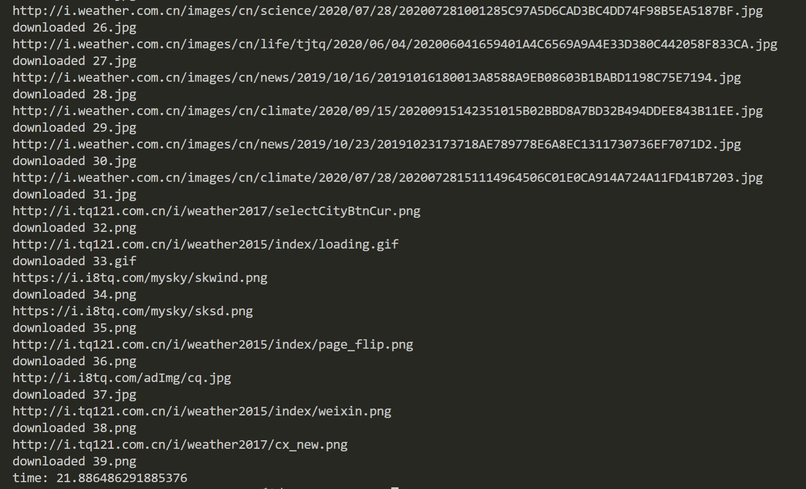
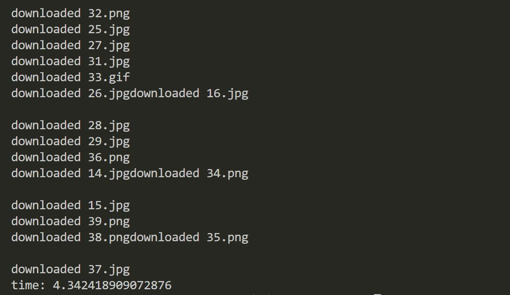
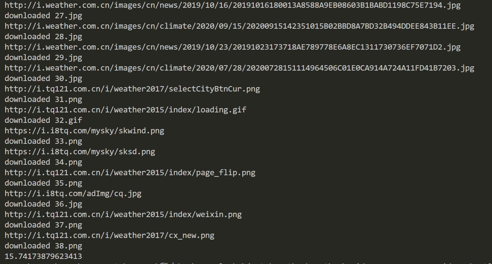
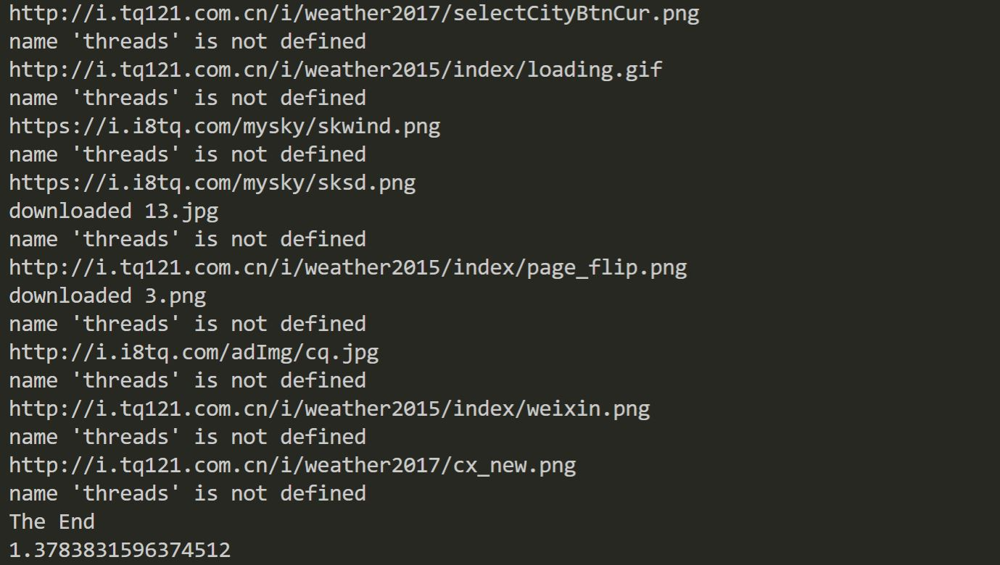
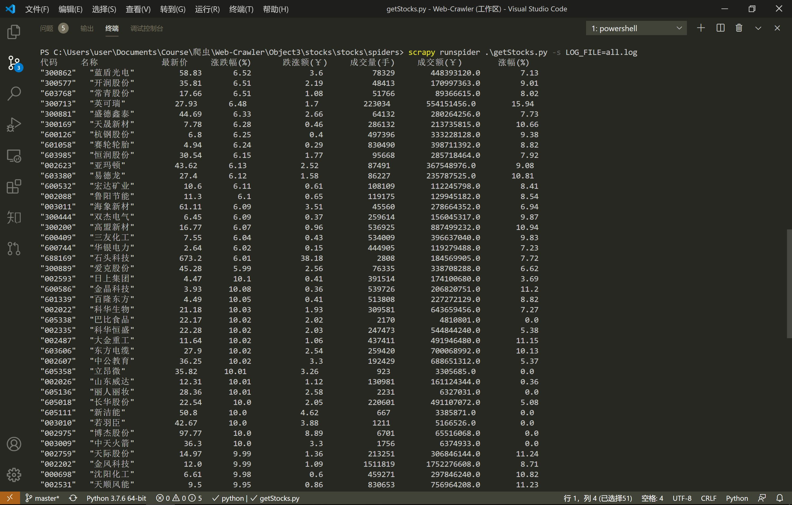

# 数据采集与融合技术第三次作业
## 作业一
### 要求
指定一个网站，爬取这个网站中的所有的所有图片，例如中国气象网（http://www.weather.com.cn）。分别使用单线程和多线程的方式爬取。将下载的Url信息在控制台输出，并将下载的图片存储在images子文件中，并给出截图。
### 思路
- 选择 中国气象网主页：http://www.weather.com.cn/
- 分别用单线程和多线程实现爬取图片
- 将各个部件封装成函数，在线程内部调用
### code
#### 单线程
```
from bs4 import BeautifulSoup
from bs4 import UnicodeDammit
import urllib.request
import time
from urllib.parse import urlparse
import re
from random import random

def imageSpider(start_url):
    try:
        # nextUrl = []
        urls=[]
        req=urllib.request.Request(start_url,headers=headers)
        data=urllib.request.urlopen(req)
        data=data.read()
        dammit=UnicodeDammit(data,["utf-8","gbk"])
        data=dammit.unicode_markup
        soup=BeautifulSoup(data,"lxml")
        images=soup.select("img")
        for image in images: 
            try:
                src=image["src"]
                url=urllib.request.urljoin(start_url,src) 
                if url not in urls:
                    urls.append(url) 
                    print(url)
                    download(url)
            except Exception as err:
                print(err)
        # nextUrl = getInternalLinks(soup,nextUrl)
        # start_url = nextUrl[random(len(nextUrl))]
        return start_url
    except Exception as err:
            print(err)

def download(url): 
    global count
    try:
        count=count+1
        #提取文件后缀扩展名
        if(url[len(url)-4]=="."):
            ext=url[len(url)-4:]
        else:
            ext=""
        req=urllib.request.Request(url,headers=headers)
        data=urllib.request.urlopen(req,timeout=100) 
        data=data.read() 
        fobj=open("Object3/singleThreadImages/"+str(count)+ext,"wb") 
        fobj.write(data)
        fobj.close()
        print("downloaded "+str(count)+ext)
    except Exception as err: 
        print(err)

start_time = time.time()
start_url = "http://www.weather.com.cn/"
# start_url="http://www.weather.com.cn/weather/101280601.shtml"
headers = {"User-Agent": "Mozilla/5.0 (Windows; U; Windows NT 6.0 x64; en-US; rv:1.9pre) Gecko/2008072421 Minefield/3.0.2pre"}
count=0
imageSpider(start_url)
print(time.time()-start_time)
```
##### 单线程结果

耗时大约20s

#### 多线程
```
from bs4 import BeautifulSoup
from bs4 import UnicodeDammit
import urllib.request
import threading
import time

def imageSpider(start_url):
    global threads
    global count
    try:
        urls=[]
        req=urllib.request.Request(start_url,headers=headers)
        data=urllib.request.urlopen(req)
        data=data.read()
        dammit=UnicodeDammit(data,["utf-8","gbk"])
        data=dammit.unicode_markup
        soup=BeautifulSoup(data,"lxml")
        images=soup.select("img")
        for image in images:
            try:
                src=image["src"]
                url=urllib.request.urljoin(start_url,src) 
                if url not in urls:
                    print(url)
                    count=count+1
                    T=threading.Thread(target=download,args=(url,count))
                    T.setDaemon(False)
                    T.start() 
                    threads.append(T)
                    urls.append(url)
            except Exception as err:
                print(err)
    except Exception as err:
        print(err)

def download(url,count):
    try:
        if(url[len(url)-4]=="."):
            ext=url[len(url)-4:]
        else:
            ext=""
        req=urllib.request.Request(url,headers=headers)
        data=urllib.request.urlopen(req,timeout=100)
        data=data.read()
        fobj=open("object3/mutliThreadImages/"+str(count)+ext,"wb")
        fobj.write(data)
        fobj.close()
        print("downloaded "+str(count)+ext)
    except Exception as err:
        print(err)

start_time = time.time()
start_url = "http://www.weather.com.cn/"
# start_url="http://www.weather.com.cn/weather/101280601.shtml"
headers = {"User-Agent": "Mozilla/5.0 (Windows; U; Windows NT 6.0 x64; en-US; rv:1.9pre)Gecko/2008072421 Minefield/3.0.2pre"}
count=0
threads=[]
imageSpider(start_url)
for t in threads:
    t.join()
print("The End")
print(time.time()-start_time)
```
##### 多线程运行结果

耗时4.34s

### 心得
由于课本上有源码，所以总体上没有什么难度，多线程的代码加了一行修掉了一个小bug（就是imageSpider函数内部增加的```urls.append(url)```）

## 作业二
### 要求
使用scrapy框架复现作业一
### 思路
思路类似，只是改用scrapy套个壳。
### code
#### 单线程
```
import scrapy
from bs4 import BeautifulSoup
from bs4 import UnicodeDammit
import urllib.request
import time
from urllib.parse import urlparse
import re
from random import random

class ArticleSpider(scrapy.Spider):
    name = 'weather'

    def start_requests(self):
        urls = ['http://www.weather.com.cn/']
        return [scrapy.Request(url = url,callback = self.parse) for url in urls]

    def parse(self,response):
        url = response.url
        start_time = time.time()
        # start_url = "http://www.weather.com.cn/"
        # start_url="http://www.weather.com.cn/weather/101280601.shtml"
        headers = {"User-Agent": "Mozilla/5.0 (Windows; U; Windows NT 6.0 x64; en-US; rv:1.9pre) Gecko/2008072421 Minefield/3.0.2pre"}
        count=0
        self.imageSpider(url,headers,count)
        # while(start_url is not None):
            # start_url = imageSpider(start_url)
            # print(start_url)
        print(time.time()-start_time)
        # imageSpider(url)
        # print("end")
        # title = response.css('title::text').extract_first()
        # print("======================================")
        # print('URL is: {}'.format(url))
        # print('Title is: {}'.format(title))
        # print("======================================")

    def imageSpider(self,start_url,headers,count):
        try:
            # nextUrl = []
            urls=[]
            req=urllib.request.Request(start_url,headers=headers)
            data=urllib.request.urlopen(req)
            data=data.read()
            dammit=UnicodeDammit(data,["utf-8","gbk"])
            data=dammit.unicode_markup
            soup=BeautifulSoup(data,"lxml")
            images=soup.select("img")
            for image in images: 
                try:
                    src=image["src"]
                    url=urllib.request.urljoin(start_url,src) 
                    if url not in urls:
                        urls.append(url) 
                        print(url)
                        self.download(url,headers,count)
                        count += 1
                except Exception as err:
                    print(err)
            # nextUrl = getInternalLinks(soup,nextUrl)
            # start_url = nextUrl[random(len(nextUrl))]
            return start_url
        except Exception as err:
                print(err)

    def download(self,url,headers,count):
        try:
            if(url[len(url)-4]=="."):
                ext=url[len(url)-4:]
            else:
                ext=""
            req=urllib.request.Request(url,headers=headers)
            data=urllib.request.urlopen(req,timeout=100)
            data=data.read()
            fobj=open("scrapyImages/"+str(count)+ext,"wb")
            fobj.write(data)
            fobj.close()
            print("downloaded "+str(count)+ext)
        except Exception as err:
            print(err)
```
##### 单线程运行结果

耗时约15s

#### 多线程
```
import scrapy
from bs4 import BeautifulSoup
from bs4 import UnicodeDammit
import urllib.request
import threading
import time

class ArticleSpider(scrapy.Spider):
    name = 'weather'

    def start_requests(self):
        urls = ['http://www.weather.com.cn/']
        return [scrapy.Request(url = url,callback = self.parse) for url in urls]

    def parse(self,response):
        start_time = time.time()
        start_url = "http://www.weather.com.cn/"
        # start_url="http://www.weather.com.cn/weather/101280601.shtml"
        headers = {"User-Agent": "Mozilla/5.0 (Windows; U; Windows NT 6.0 x64; en-US; rv:1.9pre)Gecko/2008072421 Minefield/3.0.2pre"}
        count=0
        threads=[]
        self.imageSpider(start_url,headers,count)
        for t in threads:
            t.join()
        print("The End")
        print(time.time()-start_time)

    def imageSpider(self,start_url,headers,count):
        global threads
        # global count
        try:
            urls=[]
            req=urllib.request.Request(start_url,headers=headers)
            data=urllib.request.urlopen(req)
            data=data.read()
            dammit=UnicodeDammit(data,["utf-8","gbk"])
            data=dammit.unicode_markup
            soup=BeautifulSoup(data,"lxml")
            images=soup.select("img")
            for image in images:
                try:
                    src=image["src"]
                    url=urllib.request.urljoin(start_url,src) 
                    if url not in urls:
                        print(url)
                        count=count+1
                        T=threading.Thread(target=self.download,args=(url,headers,count))
                        count += 1
                        T.setDaemon(False)
                        T.start() 
                        threads.append(T)
                        urls.append(url)
                except Exception as err:
                    print(err)
        except Exception as err:
            print(err)

    def download(self,url,headers,count):
        try:
            if(url[len(url)-4]=="."):
                ext=url[len(url)-4:]
            else:
                ext=""
            req=urllib.request.Request(url,headers=headers)
            data=urllib.request.urlopen(req,timeout=100)
            data=data.read()
            fobj=open("scrapyImages/"+str(count)+ext,"wb")
            fobj.write(data)
            fobj.close()
            print("downloaded "+str(count)+ext)
        except Exception as err:
            print(err)
```
##### 多线程运行结果

耗时大约1.37s

### 心得
- 多线程套进scrapy里面需要注意一些参数的传递，以及把函数放在class内部时定义和调用都要注意self的使用。

## 作业三
### 要求
使用scrapy框架爬取股票相关信息。候选网站：[东方财富网](https://www.eastmoney.com/)、[新浪股票](http://finance.sina.com.cn/stock/)
### 思路
与之前用json请求爬取数据类似，scrapy套个壳。
### code
```
## scrapy runspider .\getStocks.py -s LOG_FILE=all.log
import scrapy
import re
import requests

class ArticleSpider(scrapy.Spider):
    name = 'stocks'

    def start_requests(self):
        url_head = 'http://97.push2.eastmoney.com/api/qt/clist/get?cb=jQuery112406971740416068926_1601446076156&pn='
        url_tail = '&pz=20&po=1&np=1&ut=bd1d9ddb04089700cf9c27f6f7426281&fltt=2&invt=2&fid=f3&fs=m:0+t:6,m:0+t:13,m:0+t:80,m:1+t:2,m:1+t:23&fields=f1,f2,f3,f4,f5,f6,f7,f8,f9,f10,f12,f13,f14,f15,f16,f17,f18,f20,f21,f23,f24,f25,f22,f11,f62,f128,f136,f115,f152&_=1601446076157'
        urls = []
        for i in range(1,6):
            urls.append(url_head+str(i)+url_tail)
        # global count
        # count = 1
        # global count
        print('%-8s %-6s %-8s %10s %10s %12s %10s %10s %12s'%('序号','代码','名称','最新价','涨跌幅(%)','跌涨额(￥)','成交量(手)','成交额(￥)','涨幅(%)'))
        return [scrapy.Request(url = url,callback = self.parse) for url in urls]

    def parse(self,response):
        # global count
        url = response.url
        # print("=====================")
        
        # count = 1
        # global count
        # for i in range(1,6):
        self.get_stock(url)
        # self.get_stock(self,url,count)

    def get_stock(self,url):
        # global count
        json_page = requests.get(url).content.decode(encoding='utf-8')
        # json_page = json_page.read()
        pat = "\"diff\":\[\{.*\}\]"
        table = re.compile(pat,re.S).findall(json_page)
        pat = "\},\{"
        stocks = re.split(pat,table[0])
        # count = 1
        for stock in stocks:
            # print(stock)
            pat = ","
            infs = re.split(pat,stock)
            # print(infs[13])
            pat = ":"
            name = re.split(pat,infs[13])
            money = re.split(pat,infs[1])
            num = re.split(pat,infs[11])
            Quote_change = re.split(pat,infs[2])  # 涨跌幅
            Ups_and_downs = re.split(pat,infs[3])  # 涨跌额
            Volume = re.split(pat,infs[4])  #成交量
            Turnover = re.split(pat,infs[5])  #成交额
            Increase = re.split(pat,infs[6])  #涨幅
            # print(count,num[1],name[1],money[1],Quote_change[1]+"%",Ups_and_downs[1]+"￥",str(Volume[1])+"手",Turnover[1]+"￥",Increase[1]+"%")
            print('%-10s %-10s %10s %10s %15s %15s %18s %12s'%(num[1],name[1],money[1],Quote_change[1],Ups_and_downs[1],Volume[1],Turnover[1],Increase[1]))
            # count += 1
        # return count
```
#### 运行结果

### 心得
- 要把程序套进scrapy里面还是有一点难度的，要注意一下参数的传递或者设置为全局变量。
- 为了避免命令行输出过多debug信息导致杂乱，可以在运行命令后加上```-s LOG_FILE=all.log```