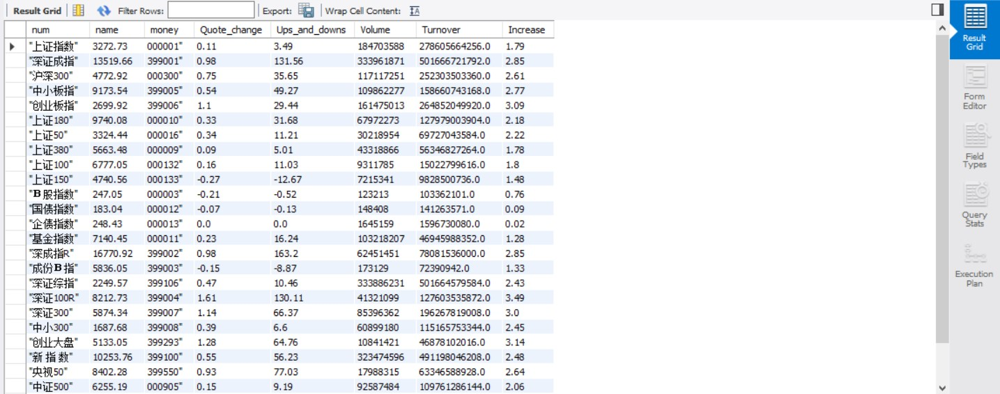

[toc]
# 作业1
## 要求
熟练掌握 scrapy 中 Item、Pipeline 数据的序列化输出方法；Scrapy+Xpath+MySQL数据库存储技术路线爬取当当网站图书数据。候选网站：[当当网](http://www.dangdang.com/)
关键词：NFV
## code
### MySQL
```
create database MyDB; 
use MyDB;
create table books
(
bTitle varchar(512) primary key,
bAuthor varchar(256),
bPublisher varchar(256),
bDate varchar(32),
bPrice varchar(16),
bDetail text
);
select * from books;
```
### ```items.py```
```
# Define here the models for your scraped items
#
# See documentation in:
# https://docs.scrapy.org/en/latest/topics/items.html

import scrapy

class DangdangItem(scrapy.Item):
    # define the fields for your item here like:
    # name = scrapy.Field()
    # pass
    title = scrapy.Field()
    author = scrapy.Field()
    date = scrapy.Field()
    publisher = scrapy.Field()
    detail = scrapy.Field()
    price = scrapy.Field()
```
### ```piplines.py```
```
# Define your item pipelines here
#
# Don't forget to add your pipeline to the ITEM_PIPELINES setting
# See: https://docs.scrapy.org/en/latest/topics/item-pipeline.html


# useful for handling different item types with a single interface
# from itemadapter import ItemAdapter
import pymysql

class DangdangPipeline(object):

    opened = False
    count = 0
    def open_spider(self,spider):
        try:
            print("*********************opened*********************")
            # self.con = pymysql.connect(host = "127.0.0.1",post = 3306,user = "root",passwd = "02071035",db = "MyDB",charset = "utf8")
            # serverName = "127.0.0.1:1433"
            serverName = "127.0.0.1"
            # userName = "sa"
            passWord = "02071035"
            # port = "1433",user = userName,password = password,
            # ,server='SZS\SQLEXPRESS'
            self.con = pymysql.connect(host = serverName,port = 3306,user = "root",password = passWord,database = "MyDB",charset = "utf8")
            self.cursor = self.con.cursor()
            # self.cursor.execute('use MyDB')
            self.opened = True
            # self.count = 0
            # print(self.count)
        except Exception as err:
            print(err)
            self.opened = False

    def close_spider(self,spider):
        if self.opened>0:
            self.con.commit()
            self.con.close()
            # self.count = 0
            self.opened = False
        print("closed")
        print("一共爬取",self.count,"本书籍")

    def process_item(self, item, spider):
        try:
            print(item["title"])
            print(item["author"])
            print(item["publisher"])
            print(item["date"])
            print(item["price"])
            print(item["detail"])
            print()
            if self.opened:
                self.cursor.execute("insert books(bTitle,bAuthor,bPublisher,bDate,bPrice,bDetail) values (%s,%s,%s,%s,%s,%s)",(item["title"],item["author"],item["publisher"],item["date"],item["price"],item["detail"]))
                self.count+=1
        except Exception as err:
            print(err)
        return item
```
### ```myspider.py```
```
# cd c:/mysql/mysql-8.0.22-winx64/mysql-8.0.22-winx64/bin
# teCBywk)M5aq
import scrapy
from Dangdang.items import DangdangItem
from bs4 import BeautifulSoup
from bs4 import UnicodeDammit

class MySpider(scrapy.Spider):
    name = "mySpider"
    key = 'NFV'
    source_url='http://search.dangdang.com/'

    def start_requests(self):
        url = MySpider.source_url+"?key="+MySpider.key
        yield scrapy.Request(url=url,callback=self.parse)

    def parse(self, response): 
        try:
            dammit = UnicodeDammit(response.body, ["utf-8", "gbk"])
            data = dammit.unicode_markup
            selector=scrapy.Selector(text=data)
            lis=selector.xpath("//li['@ddt-pit'][starts-with(@class,'line')]")
            for li in lis:
                title=li.xpath("./a[position()=1]/@title").extract_first()
                price = li.xpath("./p[@class='price']/span[@class='search_now_price']/text()").extract_first()
                author = li.xpath("./p[@class='search_book_author']/span[position()=1]/a/@title").extract_first()
                date = li.xpath("./p[@class='search_book_author']/span[position()=last()- 1]/text()").extract_first()
                publisher = li.xpath("./p[@class='search_book_author']/span[position()=last()]/a/@title ").extract_first()
                detail = li.xpath("./p[@class='detail']/text()").extract_first()
                #detail有时没有，结果None
                item=DangdangItem()
                item["title"]=title.strip() if title else ""
                item["author"]=author.strip() if author else ""
                item["date"] = date.strip()[1:] if date else ""
                item["publisher"] = publisher.strip() if publisher else ""
                item["price"] = price.strip() if price else ""
                item["detail"] = detail.strip() if detail else ""
                yield item
                #最后一页时link为None
            link=selector.xpath("//div[@class='paging']/ul[@name='Fy']/li[@class='next']/a/@href").extract_first()
            if link:
                url=response.urljoin(link)
                yield scrapy.Request(url=url, callback=self.parse)

        except Exception as err:
            print(err)


```
## 结果


## 心得体会
用```pymysql```连接MySQL遇到了点小问题，主要是不熟悉SQL语句的问题，以及table的create和drop。
# 作业2
## 要求
熟练掌握 scrapy 中 Item、Pipeline 数据的序列化输出方法；Scrapy+Xpath+MySQL数据库存储技术路线爬取股票相关信息
候选网站：[东方财富网](https://www.eastmoney.com/)、[新浪股票](http://finance.sina.com.cn/stock/)
## code
### MySQL
```
use MyDB;
create table stocks(
num varchar(128),
name varchar(128),
money varchar(128),
Quote_change varchar(128),
Ups_and_downs varchar(128),
Volume varchar(128),
Turnover varchar(128),
Increase varchar(128)
);
select * from stocks;
```
### ```items.py```
```
# Define here the models for your scraped items
#
# See documentation in:
# https://docs.scrapy.org/en/latest/topics/items.html

import scrapy

class StocksItem(scrapy.Item):
    # define the fields for your item here like:
    # name = scrapy.Field()
    # pass
    name = scrapy.Field()
    money = scrapy.Field()
    num = scrapy.Field()
    Quote_change = scrapy.Field()
    Ups_and_downs = scrapy.Field()
    Volume = scrapy.Field()
    Turnover = scrapy.Field()
    Increase = scrapy.Field()
```
### ```piplines.py```
```
# Define your item pipelines here
#
# Don't forget to add your pipeline to the ITEM_PIPELINES setting
# See: https://docs.scrapy.org/en/latest/topics/item-pipeline.html


# useful for handling different item types with a single interface
# from itemadapter import ItemAdapter
import pymysql

class StocksPipeline(object):

    opened = False
    count = 0
    def open_spider(self,spider):
        try:
            # self.con = pymysql.connect(host = "127.0.0.1",post = 3306,user = "root",passwd = "02071035",db = "MyDB",charset = "utf8")
            # serverName = "127.0.0.1:1433"
            serverName = "127.0.0.1"
            # userName = "sa"
            passWord = "02071035"
            # port = "1433",user = userName,password = password,
            # ,server='SZS\SQLEXPRESS'
            self.con = pymysql.connect(host = serverName,port = 3306,user = "root",password = passWord,database = "MyDB",charset = "utf8")
            self.cursor = self.con.cursor()
            # self.cursor.execute('use MyDB')
            self.opened = True
            # self.count = 0
            # print(self.count)
        except Exception as err:
            print(err)
            self.opened = False

    def close_spider(self,spider):
        if self.opened>0:
            self.con.commit()
            self.con.close()
            # self.count = 0
            self.opened = False
        print("closed")
        print("一共爬取",self.count,"支股票")

    def process_item(self, item, spider):
        try:
            # print(item["name"])
            # print(item["money"])
            # print(item["num"])
            # print(item["Quote_change"])
            # print(item["Ups_and_downs"])
            # print(item["Volume"])
            # print(item["Turnover"])
            # print(item["Increase"])
            # print()
            if self.opened:
                self.cursor.execute("insert stocks(num,name,money,Quote_change,Ups_and_downs,Volume,Turnover,Increase) values (%s,%s,%s,%s,%s,%s,%s,%s)",(item["name"],item["money"],item["num"],item["Quote_change"],item["Ups_and_downs"],item["Volume"],item["Turnover"],item["Increase"]))
                self.count+=1
        except Exception as err:
            print(err)
        return item
```
### ```myspider.py```
```
import scrapy
from stocks.items import StocksItem
from bs4 import BeautifulSoup
from bs4 import UnicodeDammit
import requests
import re

class MySpider(scrapy.Spider):
    name = "mySpider"
    key = 'NFV'
    url_head = 'http://5.push2.eastmoney.com/api/qt/clist/get?cb=jQuery112406332527910963062_1603964168360&pn='
    url_tail = '&pz=50&po=1&np=1&ut=bd1d9ddb04089700cf9c27f6f7426281&fltt=2&invt=2&fid=&fs=b:MK0010&fields=f1,f2,f3,f4,f5,f6,f7,f8,f9,f10,f12,f13,f14,f15,f16,f17,f18,f20,f21,f23,f24,f25,f26,f22,f11,f62,f128,f136,f115,f152&_=1603964168385'
    urls = []

    def start_requests(self):
        url = MySpider.url_head+'1'+MySpider.url_tail
        print(url)
        yield scrapy.Request(url=url,callback=self.parse)

    def parse(self, response): 
        try:
            url = response.url
            json_page = requests.get(url).content.decode(encoding='utf-8')
            pat = "\"diff\":\[\{.*\}\]"
            table = re.compile(pat,re.S).findall(json_page)
            pat = "\},\{"
            stocks = re.split(pat,table[0])
            count = 1
            for stock in stocks:
                pat = ","
                infs = re.split(pat,stock)
                pat = ":"
                name = re.split(pat,infs[13])
                money = re.split(pat,infs[1])
                num = re.split(pat,infs[11])
                Quote_change = re.split(pat,infs[2])  # 涨跌幅
                Ups_and_downs = re.split(pat,infs[3])  # 涨跌额
                Volume = re.split(pat,infs[4])  #成交量
                Turnover = re.split(pat,infs[5])  #成交额
                Increase = re.split(pat,infs[6])  #涨幅
                print('%-8s %-10s %-10s %10s %10s %15s %15s %18s %12s'%(count,num[1],name[1],money[1],Quote_change[1],Ups_and_downs[1],Volume[1],Turnover[1],Increase[1]))
                count += 1
                item=StocksItem()
                item["name"]=name[1] if name else ""
                item["money"]=money[1] if money else ""
                item["num"] = num[1][1:] if num else ""
                item["Quote_change"] = Quote_change[1] if Quote_change else ""
                item["Ups_and_downs"] = Ups_and_downs[1] if Ups_and_downs else ""
                item["Volume"] = Volume[1] if Volume else ""
                item["Turnover"] = Turnover[1] if Turnover else ""
                item["Increase"] = Increase[1] if Increase else ""
                yield item

        except Exception as err:
            print(err)
```
## 结果


## 心得体会
Json文件不能用xpath，故改用正则表达式解析得到信息，大致的框架和作业一相差不多。
# 作业3
## 要求
熟练掌握 scrapy 中 Item、Pipeline 数据的序列化输出方法；使用scrapy框架+Xpath+MySQL数据库存储技术路线爬取外汇网站数据。
候选网站：[招商银行网](http://fx.cmbchina.com/hq/)
## code
### MySQL
```
use MyDB;
drop table exchanges;
create table exchanges(
id varchar(16),
currency varchar(16),
tsp varchar(16),
csp varchar(16),
tbp varchar(16),
cbp varchar(16),
time varchar(16)
);
select * from exchanges;
```
### ```items.py```
```
# Define here the models for your scraped items
#
# See documentation in:
# https://docs.scrapy.org/en/latest/topics/items.html
import scrapy

class ExchangeItem(scrapy.Item):
    # define the fields for your item here like:
    # name = scrapy.Field()
    # pass
    currency = scrapy.Field()
    tsp = scrapy.Field()
    csp = scrapy.Field()
    tbp = scrapy.Field()
    cbp = scrapy.Field()
    time = scrapy.Field()
```
### ```piplines.py```
```
# Define your item pipelines here
#
# Don't forget to add your pipeline to the ITEM_PIPELINES setting
# See: https://docs.scrapy.org/en/latest/topics/item-pipeline.html
# useful for handling different item types with a single interface

from itemadapter import ItemAdapter
import pymysql

class ExchangePipeline:
    opened = False
    count = 0
    def open_spider(self,spider):
        try:
            print("*********************opened*********************")
            # self.con = pymysql.connect(host = "127.0.0.1",post = 3306,user = "root",passwd = "02071035",db = "MyDB",charset = "utf8")
            # serverName = "127.0.0.1:1433"
            serverName = "127.0.0.1"
            # userName = "sa"
            passWord = "02071035"
            # port = "1433",user = userName,password = password,
            # ,server='SZS\SQLEXPRESS'
            self.con = pymysql.connect(host = serverName,port = 3306,user = "root",password = passWord,database = "MyDB",charset = "utf8")
            self.cursor = self.con.cursor()
            # self.cursor.execute('use MyDB')
            self.opened = True
            # self.count = 0
            # print(self.count)
        except Exception as err:
            print(err)
            self.opened = False

    def close_spider(self,spider):
        if self.opened>0:
            self.con.commit()
            self.con.close()
            # self.count = 0
            self.opened = False
        print("closed")
        print("一共爬取",self.count,"种外汇")

    def process_item(self, item, spider):
        try:
            # print(item["currency"])
            # print(item["tsp"])
            # print(item["csp"])
            # print(item["tbp"])
            # print(item["cbp"])
            # print(item["time"])
            # print()
            if self.opened:
                self.cursor.execute("insert exchanges(id,currency,tsp,csp,tbp,cbp,time) values (%s,%s,%s,%s,%s,%s,%s)",(self.count,item["currency"],item["tsp"],item["csp"],item["tbp"],item["cbp"],item["time"]))
                self.count+=1
        except Exception as err:
            print(err)
        return item
```
### ```myspider.py```
```
import scrapy
from exchange.items import ExchangeItem
from bs4 import BeautifulSoup
from bs4 import UnicodeDammit

class MySpider(scrapy.Spider):
    name = "mySpider"
    source_url='http://fx.cmbchina.com/hq/'

    def start_requests(self):
        url = MySpider.source_url
        yield scrapy.Request(url=url,callback=self.parse)

    def parse(self, response): 
        try:
            dammit = UnicodeDammit(response.body, ["utf-8", "gbk"])
            data = dammit.unicode_markup
            # print(type(data))
            selector=scrapy.Selector(text=data)
            # print(type(selector))
            trs=selector.xpath("//div[@id = \"realRateInfo\"]//tr")
            # print(trs)
            # print(trs[0])
            for tr in trs:
                currency=tr.xpath("./td[@class = 'fontbold']/text()").extract_first()
                # print(currency)
                tsp = tr.xpath("./td[@class = 'numberright'][1]/text()").extract_first()
                # print(tsp)
                csp = tr.xpath("./td[@class = 'numberright'][2]/text()").extract_first()
                # print(csp)
                tbp = tr.xpath("./td[@class = 'numberright'][3]/text()").extract_first()
                # print(tbp)
                cbp = tr.xpath("./td[@class = 'numberright'][4]/text()").extract_first()
                # print(cbp)
                time = tr.xpath("./td[@align = 'center'][last()-1]/text()").extract_first()
                print(str(currency).strip(),str(tsp).strip(),str(csp).strip(),str(tbp).strip(),str(cbp).strip(),str(time).strip())
                #detail有时没有，结果None
                item=ExchangeItem()
                item["currency"]=currency.strip() if currency else ""
                item["tsp"]=tsp.strip() if tsp else ""
                item["csp"] = csp.strip()[1:] if csp else ""
                item["tbp"] = tbp.strip() if tbp else ""
                item["cbp"] = cbp.strip() if cbp else ""
                item["time"] = time.strip() if time else ""
                yield item
                #最后一页时trnk为None
            link=selector.xpath("//div[@class='paging']/ul[@name='Fy']/li[@class='next']/a/@href").extract_first()
            if link:
                url=response.urljoin(link)
                yield scrapy.Request(url=url, callback=self.parse)
        except Exception as err:
            print(err)
```
## 结果


## 心得体会
网站的的信息存在一个```table```内部的```tbody```下，用xpath解析的时候花了点时间，用xpath匹配时可以用```xpath()[]```选择匹配元素的序号。