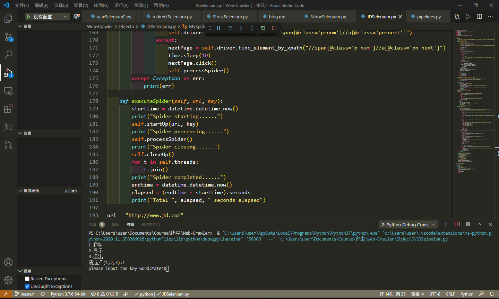
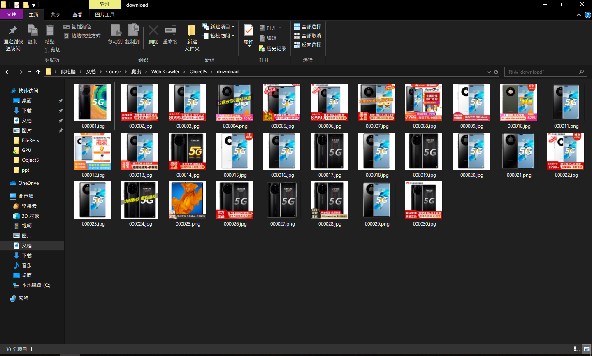
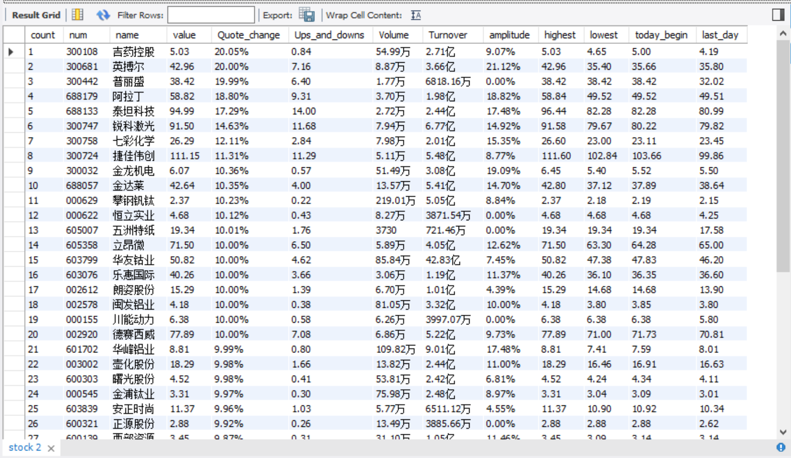
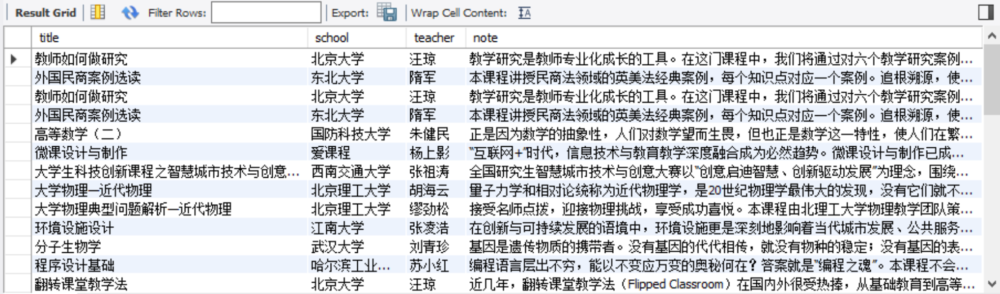

[toc]
# 数据采集与融合技术第五次作业（Selenium的使用）
## 作业一
### 要求
- 熟练掌握 Selenium 查找HTML元素、爬取Ajax网页数据、等待HTML元素等内容。
- 使用Selenium框架爬取京东商城某类商品信息及图片。
- 候选网站：http://www.jd.com/
### 思路
selenium模拟爬取京东，主要的难点在于模拟搜索过程和翻页过程，单页信息爬取其实之前都训练过。
### code
```
from selenium import webdriver
from selenium.webdriver.edge.options import Options
import urllib.request
import threading
import sqlite3
import os
import datetime
from selenium.webdriver.common.keys import Keys
import time


class MySpider:
    headers = {
        "User-Agent": "Mozilla/5.0 (Windows; U; Windows NT 6.0 x64; en-US; rv:1.9pre) Gecko/2008072421 Minefield/3.0.2pre"}
    imagePath = "Object5\download"

    def startUp(self, url, key):
            # # Initializing edge browser
            # edge_options = Options()
            # edge_options.add_argument('--headless')
            # edge_options.add_argument('--disable-gpu')
            # self.driver = webdriver.edge(edge_options=edge_options)
            self.driver = webdriver.Edge(executable_path='C:\Program Files (x86)\Microsoft\Edge\Application\msedgedriver.exe')

            # Initializing variables
            self.threads = []
            self.No = 0
            self.imgNo=0
            # Initializing database
            try:
                self.con = sqlite3.connect("phones.db")
                self.cursor = self.con.cursor()
                try:
                    # 如果有表就删除
                    self.cursor.execute("drop table phones")
                except:
                    pass
                try:
                    #  建立新的表
                    sql = "create  table  phones  (mNo  varchar(32) primary key, mMark varchar(256),mPrice varchar(32),mNote varchar(1024),mFile varchar(256))"
                    self.cursor.execute(sql)
                except:
                    pass
            except Exception as err:
                print(err)
            # Initializing images folder
            try:
                if not os.path.exists(MySpider.imagePath):
                    os.mkdir(MySpider.imagePath)
                images = os.listdir(MySpider.imagePath)
                for img in images:
                    s = os.path.join(MySpider.imagePath, img)
                    os.remove(s)
            except Exception as err:
                print(err)
            self.driver.get(url)
            keyInput = self.driver.find_element_by_id("key")
            keyInput.send_keys(key)
            keyInput.send_keys(Keys.ENTER)

    def closeUp(self):
        try:
            self.con.commit()
            self.con.close()
            self.driver.close()
        except Exception as err:
            print(err);

    def insertDB(self, mNo, mMark, mPrice, mNote, mFile):
        try:
            sql = "insert into phones (mNo,mMark,mPrice,mNote,mFile) values (?,?,?,?,?)"
            self.cursor.execute(sql, (mNo, mMark, mPrice, mNote, mFile))
        except Exception as err:
            print(err)

    def showDB(self):
        try:
            con = sqlite3.connect("phones.db")
            cursor =con.cursor()
            print("%-8s%-16s%-8s%-16s%s"%("No", "Mark", "Price", "Image", "Note"))
            cursor.execute("select mNo,mMark,mPrice,mFile,mNote from phones  order by mNo")
            rows = cursor.fetchall()
            for row in rows:
                print("%-8s %-16s %-8s %-16s %s" % (row[0], row[1], row[2], row[3],row[4]))
            con.close()
        except Exception as err:
            print(err)
    def download(self, src1, src2, mFile):
        data = None
        if src1:
            try:
                req = urllib.request.Request(src1, headers=MySpider.headers)
                resp = urllib.request.urlopen(req, timeout=10)
                data = resp.read()
            except:
                pass
        if not data and src2:
            try:
                req = urllib.request.Request(src2, headers=MySpider.headers)
                resp = urllib.request.urlopen(req, timeout=10)
                data = resp.read()
            except:
                pass
        if data:
            print("download begin", mFile)
            fobj = open(MySpider.imagePath + "\\" + mFile, "wb")
            fobj.write(data)
            fobj.close()
            print("download finish", mFile)

    def processSpider(self):
        try:
            time.sleep(1)
            print(self.driver.current_url)
            lis =self.driver.find_elements_by_xpath("//div[@id='J_goodsList']//li[@class='gl-item']")
            for li in lis:
            # We find that the image is either in src or in data-lazy-img attribute
                try:
                    src1 = li.find_element_by_xpath(".//div[@class='p-img']//a//img").get_attribute("src")
                except:
                    src1 = ""

                try:
                    src2 = li.find_element_by_xpath(".//div[@class='p-img']//a//img").get_attribute("data-lazy-img")
                except:
                    src2 = ""

                try:
                    price = li.find_element_by_xpath(".//div[@class='p-price']//i").text
                except:
                    price = "0"

                try:
                    note = li.find_element_by_xpath(".//div[@class='p-name p-name-type-2']//em").text
                    mark = note.split(" ")[0]
                    mark = mark.replace("爱心东东\n", "")
                    mark = mark.replace(",", "")
                    note = note.replace("爱心东东\n", "")
                    note = note.replace(",", "")

                except:
                    note = ""
                    mark = ""
                self.No = self.No + 1
                no = str(self.No)
                while len(no) < 6:
                    no = "0" + no
                # print(no, mark, price)
                if src1:
                    src1 = urllib.request.urljoin(self.driver.current_url, src1)
                    p = src1.rfind(".")
                    mFile = no + src1[p:]
                elif src2:
                    src2 = urllib.request.urljoin(self.driver.current_url, src2)
                    p = src2.rfind(".")
                    mFile = no + src2[p:]
                if src1 or src2:
                    T = threading.Thread(target=self.download, args=(src1, src2, mFile))
                    T.setDaemon(False)
                    T.start()
                    self.threads.append(T)
                else:
                    mFile = ""
                if price != "0":
                    self.insertDB(no, mark, price, note, mFile)

                # 取下一页的数据，直到最后一页
                try:
                    self.driver.find_element_by_xpath("//span[@class='p-num']//a[@class='pn-next']")
                except:
                    nextPage = self.driver.find_element_by_xpath("//span[@class='p-num']//a[@class='pn-next']")
                    time.sleep(10)
                    nextPage.click()
                    self.processSpider()
        except Exception as err:
            print(err)

    def executeSpider(self, url, key):
        starttime = datetime.datetime.now()
        print("Spider starting......")
        self.startUp(url, key)
        print("Spider processing......")
        self.processSpider()
        print("Spider closing......")
        self.closeUp()
        for t in self.threads:
            t.join()
        print("Spider completed......")
        endtime = datetime.datetime.now()
        elapsed = (endtime - starttime).seconds
        print("Total ", elapsed, " seconds elapsed")

url = "http://www.jd.com"
spider = MySpider()
while True:
    print("1.爬取")
    print("2.显示")
    print("3.退出")
    s = input("请选择(1,2,3):")
    if s == "1":
        keyword = input("please input the key word:")
        spider.executeSpider(url, keyword)
        continue
    elif s == "2":
        spider.showDB()
        continue
    elif s == "3":
        break
```
### result


### 心得体会
Selenium模拟相比与之前的BS4或者是scrapy，更加直观且更加直接的感受到了爬虫的效果，但是缺点在于浏览器渲染和加载时间会影响爬虫运行速度。
## 作业二
### 要求
- 熟练掌握 Selenium 查找HTML元素、爬取Ajax网页数据、等待HTML元素等内容。
- 使用Selenium框架+ MySQL数据库存储技术路线爬取“沪深A股”、“上证A股”、“深证A股”3个板块的股票数据信息。
- 候选网站：[东方财富网](http://quote.eastmoney.com/center/gridlist.html#hs_a_board)
### 思路
之前处理这个网站主要是通过json请求的截获，而Selenium则可以直接爬取网站，不需要翻找页面数据流向找json文件的链接。
### code
#### ```StockSelenium.py```
```
from selenium import webdriver
import time
import pymysql

class Spider():
    headers = {
        "User-Agent": "Mozilla/5.0 (Windows; U; Windows NT 6.0 x64; en-US; rv:1.9pre) Gecko/2008072421 Minefield/3.0.2pre"}
    count = 1
    # def initDriver(self):
        # count = 1
    driver = webdriver.Edge(executable_path='C:\Program Files (x86)\Microsoft\Edge\Application\msedgedriver.exe')
    driver.get('http://quote.eastmoney.com/center/gridlist.html')

    def getInfo(self):
        print("Page",self.count)
        self.count += 1
        self.StockInfo()
        try:
            keyInput = self.driver.find_element_by_class_name("paginate_input")
            keyInput.clear()
            keyInput.send_keys(self.count)
            # keyInput.send_keys(self.count.ENTER)
            GoButton = self.driver.find_element_by_class_name("paginte_go")
            GoButton.click()
            time.sleep(3)
            self.getInfo()
        except:
            print("err")
            time.sleep(3)
            self.getInfo()
            
    def StockInfo(self):
        odds = self.driver.find_elements_by_class_name("odd")
        evens = self.driver.find_elements_by_class_name("even")
        for i in range(len(odds)):
            self.StockDetailInfo(odds[i])
            self.StockDetailInfo(evens[i])

    def StockDetailInfo(self,elem):
        tds = elem.find_elements_by_tag_name("td")
        count = tds[0].text
        num = tds[1].text #编号
        name = tds[2].text #名称
        value = tds[4].text # 最新价
        Quote_change = tds[5].text # 涨跌幅
        Ups_and_downs = tds[6].text # 涨跌额
        Volume = tds[7].text # 成交量
        Turnover = tds[8].text # 成交额
        amplitude = tds[9].text # 振幅
        highest = tds[10].text # 最高
        lowest = tds[11].text # 最低
        today_begin = tds[12].text # 进开
        last_day = tds[13].text # 昨收
        # print(count,num,name,value,Quote_change,Ups_and_downs,Volume,Turnover,amplitude,highest,lowest,today_begin,last_day)
        self.writeMySQL(count,num,name,value,Quote_change,Ups_and_downs,Volume,Turnover,amplitude,highest,lowest,today_begin,last_day)
        # for value in values:
        # print(num,name,values[0].text,values[1].text)

    def initDatabase(self):
        try:
            serverName = "127.0.0.1"
            # userName = "sa"
            passWord = "********"
            self.con = pymysql.connect(host = serverName,port = 3307,user = "root",password = passWord,database = "Stock",charset = "utf8")
            self.cursor = self.con.cursor()
            self.cursor.execute("use Stock")
            print("init DB over")
            self.cursor.execute("select * from stock")
        except:
            print("init err")

    def writeMySQL(self,count,num,name,value,Quote_change,Ups_and_downs,Volume,Turnover,amplitude,highest,lowest,today_begin,last_day):
        try:
            print(count,num,name,value,Quote_change,Ups_and_downs,Volume,Turnover,amplitude,highest,lowest,today_begin,last_day)
            self.cursor.execute("insert stock(count,num,name,value,Quote_change,Ups_and_downs,Volume,Turnover,amplitude,highest,lowest,today_begin,last_day) values (%s,%s,%s,%s,%s,%s,%s,%s,%s,%s,%s,%s,%s)",(count,num,name,value,Quote_change,Ups_and_downs,Volume,Turnover,amplitude,highest,lowest,today_begin,last_day))
            self.con.commit()
        except Exception as err:
            print(err)
            # self.opened = False

spider = Spider()
spider.initDatabase()
spider.getInfo()
```
### result


### 心得体会
翻页的功能遇到了一点问题，所以干脆用输入页码的形式进行翻页。
此外，这个网站要在开盘时间才能爬到数据，且不能过于频繁地爬取数据，容易出现TIME OUT的问题，可能是网站本身的限制。
## 作业三
### 要求
- 熟练掌握 Selenium 查找HTML元素、实现用户模拟登录、爬取Ajax网页数据、等待HTML元素等内容。
- 使用Selenium框架+MySQL爬取中国mooc网课程资源信息（课程号、课程名称、学校名称、主讲教师、团队成员、参加人数、课程进度、课程简介）
- 候选网站：[中国mooc网](https://www.icourse163.org)
### 思路
由于mooc平台课程过多，于是选择爬取所有的[国家精品课程](https://www.icourse163.org/channel/2001.htm)
### code
逻辑大同小异，由于时间紧迫，就不爬取所有信息了。
#### ```MoocSelenium.py```
```
from selenium import webdriver
import time
import pymysql

class Spider():
    # headers = {
    #     "User-Agent": "Mozilla/5.0 (Windows; U; Windows NT 6.0 x64; en-US; rv:1.9pre) Gecko/2008072421 Minefield/3.0.2pre"}
    count = 1
    driver = webdriver.Edge(executable_path='C:\Program Files (x86)\Microsoft\Edge\Application\msedgedriver.exe')
    driver.get('https://www.icourse163.org/channel/2001.htm')
    driver.maximize_window()

    def getInfo(self):
        print("Page",self.count)
        self.count += 1
        courses = self.driver.find_elements_by_xpath("//div[@class='_1gBJC']//div[@class='_2mbYw']//div[@class='_3KiL7']")
        titles = self.driver.find_elements_by_xpath("//div[@class='_1gBJC']/div/div//div[@class='_1Bfx4']/div//h3") #课程标题
        schools = self.driver.find_elements_by_xpath("//div[@class='_1gBJC']/div/div//div[@class='_1Bfx4']/div//p") #学校
        teachers = self.driver.find_elements_by_xpath("//div[@class='_1gBJC']/div/div//div[@class='_1Bfx4']/div//div[@class='_1Zkj9']") #授课老师
        for i in range(len(courses)):
            title = titles[i].text
            school = schools[i].text
            teacher = teachers[i].text
            course = courses[i]
            webdriver.ActionChains(self.driver).move_to_element(course).click(course).perform()
            time.sleep(3)
            # print(self.driver.current_url)
            handles = self.driver.window_handles
            self.driver.switch_to.window(handles[1])
            # self.getCourseInfo()
            note = self.driver.find_element_by_class_name("course-heading-intro_intro")
            # print(title,school,teacher,note.text)
            self.writeMySQL(title,school,teacher,note.text)
            self.driver.close()
            handles = self.driver.window_handles
            self.driver.switch_to.window(handles[0])
        self.nextPage()

    def getCourseInfo(self):
        try:
            note = self.driver.find_element_by_class_name("course-heading-intro_intro")
            print(note.text)
        except:
            notes = None
            print("err")

    def nextPage(self):
        try:
            GoButton = self.driver.find_element_by_xpath("//div[@class='_1lKzE']//a[@class='_3YiUU '][last()]")
            GoButton.click()
            time.sleep(3)
            self.getInfo()
        except:
            print("err")
            time.sleep(3)
            self.getInfo()

    def initDatabase(self):
        try:
            serverName = "127.0.0.1"
            # userName = "sa"
            passWord = "02071035"
            self.con = pymysql.connect(host = serverName,port = 3307,user = "root",password = passWord,database = "Mooc",charset = "utf8")
            self.cursor = self.con.cursor()
            self.cursor.execute("use Mooc")
            print("init DB over")
            self.cursor.execute("select * from mooc")
        except:
            print("init err")

    def writeMySQL(self,title,school,teacher,note):
        try:
            print(title,school,teacher,note)
            self.cursor.execute("insert mooc(title,school,teacher,note) values (%s,%s,%s,%s)",(title,school,teacher,note))
            self.con.commit()
        except Exception as err:
            print(err)
            # self.opened = False

spider = Spider()
spider.initDatabase()
spider.getInfo()
```
### result


### 心得体会
- 网页有两部分，一部分是推荐课程，我们的爬取目标是所有课程，所以用xpath选择第二部分的课程信息，并用click()实现翻页。
- 还是有点难度的，主要在于课程详细信息并不保存在[大目录网址](https://www.icourse163.org/channel/2001.htm)中，而是需要点击进入详情页面，所以也就涉及到了window的打开、切换、关闭问题。这部分功能的主要代码如下：
    ```
    webdriver.ActionChains(self.driver).move_to_element(course).click(course).perform()
            time.sleep(3)
            # print(self.driver.current_url)
            handles = self.driver.window_handles
            self.driver.switch_to.window(handles[1])
            # self.getCourseInfo()
            note = self.driver.find_element_by_class_name("course-heading-intro_intro")
            # print(title,school,teacher,note.text)
            self.writeMySQL(title,school,teacher,note.text)
            self.driver.close()
            handles = self.driver.window_handles
            self.driver.switch_to.window(handles[0])
    ```