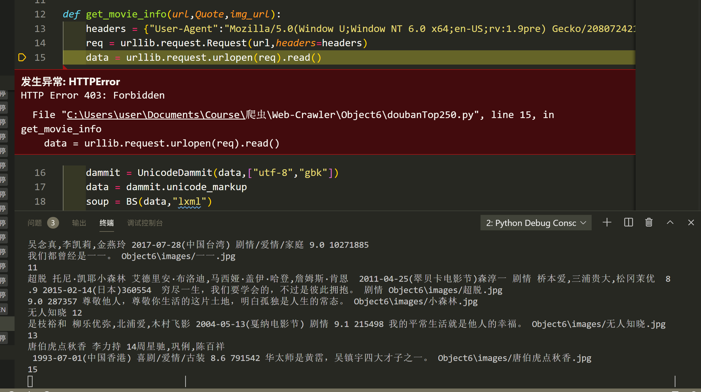
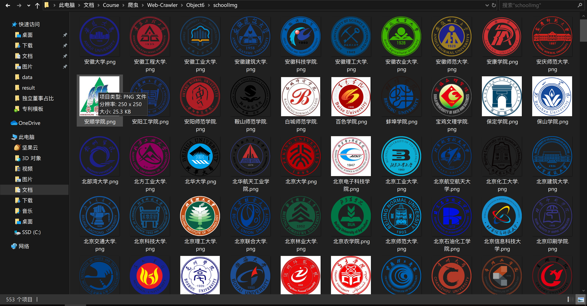
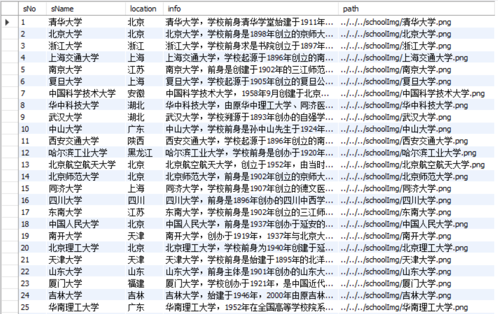
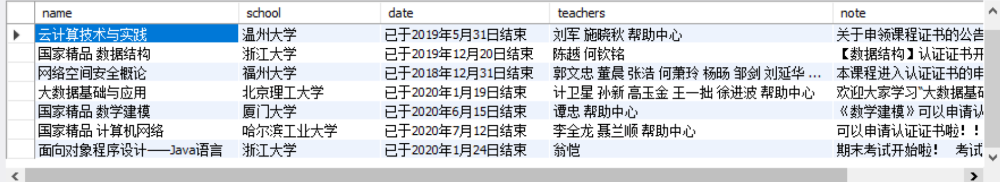

[toc]
# 数据采集与融合技术第六次作业
## 作业一
### 要求
- 用requests和BeautifulSoup库方法爬取豆瓣电影Top250数据。
- 每部电影的图片，采用多线程的方法爬取，图片名字为电影名
- 了解正则的使用方法
- 候选网站：[豆瓣电影](https://movie.douban.com/top250)
### 思路
和普通的爬取各种网站的套路差不多，只是许久不用BS4，有点手生。
### code
```
from bs4 import BeautifulSoup as BS
from bs4 import UnicodeDammit
import urllib.request
import re
import requests
import threading

url_head = "https://movie.douban.com/top250?start="
url_tail = "&filter="


def get_movie_info(url,Quote,img_url):
    headers = {"User-Agent":"Mozilla/5.0(Window U;Window NT 6.0 x64;en-US;rv:1.9pre) Gecko/208072421 Minefield/3.0.2pre"}
    req = urllib.request.Request(url,headers=headers)
    data = urllib.request.urlopen(req).read()
    dammit = UnicodeDammit(data,["utf-8","gbk"])
    data = dammit.unicode_markup
    soup = BS(data,"lxml")
    name = soup.select("span[property='v:itemreviewed']")[0].text
    name = re.split(" ",name)[0]
    director = soup.select("span[class='attrs'] a")[0].text
    actors = soup.select("span[class='actor'] a")
    actor_list = ""
    for i in range(3):
        actor_list += (actors[i].text)
        if i < 2:
            actor_list += ","
    time = soup.select("span[property='v:initialReleaseDate']")[0].text
    style = soup.select("span[property='v:genre']")
    style_list = ""
    for i in range(len(style)):
        style_list+=style[i].text
        if i < (len(style)-1):
            style_list += "/"
    score = soup.select("strong[class='ll rating_num']")[0].text
    vote_number = soup.select("span[property='v:votes']")[0].text
    img_file = requests.get(img_url).content
    with open("Object6\images/"+name+".webp","wb") as f:
        f.write(img_file)
        f.close()
        # print(name,"over")
    print(name,director,actor_list,time,style_list,score,vote_number,Quote,"Object6\images/"+name+".jpg")

try:
    threads=[]
    headers = {"User-Agent":"Mozilla/5.0(Window U;Window NT 6.0 x64;en-US;rv:1.9pre) Gecko/208072421 Minefield/3.0.2pre"}
    for i in range(10):
        url = url_head+str(i*50)+url_tail
        req = urllib.request.Request(url,headers=headers)
        # print(req)
        data = urllib.request.urlopen(req).read()
        # data = data.read()
        dammit = UnicodeDammit(data,["utf-8","gbk"])
        data = dammit.unicode_markup
        soup = BS(data,"lxml")
        lis = soup.select("ol[class='grid_view'] li")
        count = 0
        urls = []
        for li in lis:
            tag = li.a
            Quote = soup.select("span[class='inq']")[count].text
            # count += 1
            movie_url = tag.get("href")
            tag = li.img
            img_url = tag.get("src")
            if movie_url not in urls:
                count += 1
                print(count)
                T=threading.Thread(target=get_movie_info,args=(movie_url,Quote,img_url))
                T.setDaemon(False)
                T.start() 
                threads.append(T)
                urls.append(movie_url)
            # get_movie_info(movie_url,Quote,img_url)
except Exception as err:
    print(err)

```
### 结果
有时爬得太快会被403



### 心得体会
果然还是捡了芝麻对了西瓜，这题比较多的时间花在重新适应和复习BS4，真正编码的难度不大。
## 作业二
### 要求
- 熟练掌握 scrapy 中 Item、Pipeline 数据的序列化输出方法；Scrapy+Xpath+MySQL数据库存储技术路线爬取科软排名信息
- 爬取科软学校排名，并获取学校的详细链接，进入下载学校Logo存储、获取官网Url、院校信息等内容。
- 候选网站：[大学排行](https://www.shanghairanking.cn/rankings/bcur/2020)
- 关键词：学生自由选择
### 思路
单纯爬排行榜其实很简单，而且这个排行榜一页到底，甚至不用翻页。但是要获取学校校标和校训的话的话，就要根据排行榜页面的内链接进到学校主页，在主页内部爬取。
### code
#### ```getRanking.py```
```
import scrapy
from bs4 import BeautifulSoup
from bs4 import UnicodeDammit
import urllib.request
import threading
import time
import requests
from ranking.items import RankingItem
from urllib.request import urlretrieve

class RankingSpider(scrapy.Spider):
    name = 'ranking'

    def start_requests(self):
        url = 'https://www.shanghairanking.cn/rankings/bcur/2020'
        yield scrapy.Request(url = url,callback = self.parse)

    def parse(self,response):
        threads = []
        start_time = time.time()
        start_url = "https://www.shanghairanking.cn/rankings/bcur/2020"
        # start_url="http://www.weather.com.cn/weather/101280601.shtml"
        headers = {"User-Agent": "Mozilla/5.0 (Windows; U; Windows NT 6.0 x64; en-US; rv:1.9pre)Gecko/2008072421 Minefield/3.0.2pre"}
        req=urllib.request.Request(start_url,headers=headers)
        data=urllib.request.urlopen(req)
        data=data.read()
        dammit=UnicodeDammit(data,["utf-8","gbk"])
        data=dammit.unicode_markup
        soup=BeautifulSoup(data,"lxml")
        infos = soup.find('tbody').children
        count = 0
        for info in infos:
            name = info.find("a").text
            table = info.findAll("td")
            sNo = table[0].text.replace("\n","").replace(" ","")
            location = table[2].text.replace("\n","").replace(" ","")
            school_tag = info.a
            school_url = "https://www.shanghairanking.cn"+school_tag.get("href")
            try:
                req=urllib.request.Request(school_url,headers=headers)
                data=urllib.request.urlopen(req)
                data=data.read()
                dammit=UnicodeDammit(data,["utf-8","gbk"])
                data=dammit.unicode_markup
                soup=BeautifulSoup(data,"lxml")
                info=soup.findAll("p")[0].text
                imageLocation = soup.find('td',{'rowspan':'2','class':'univ-logo'}).find('img')['src']
                urlretrieve(imageLocation,'../../../schoolImg/'+name+'.png')
                print(sNo,name,location,info,'../../../schoolImg/'+name+'.png')
                item = RankingItem()
                item["sNo"] = sNo
                item["name"] = name
                item["location"] = location
                item["info"] = info
                item["path"] = '../../../schoolImg/'+name+'.png'
                yield item
            except Exception as err:
                print(err)
            # self.rankingSpider(school_url,headers,sNo,name,location)
        print("The End")
        print(time.time()-start_time)
```
#### ```piplines.py```
```
# Define your item pipelines here
#
# Don't forget to add your pipeline to the ITEM_PIPELINES setting
# See: https://docs.scrapy.org/en/latest/topics/item-pipeline.html


# useful for handling different item types with a single interface
from itemadapter import ItemAdapter
import pymysql


class RankingPipeline:
    def open_spider(self,spider):
        try:
            print("*******************opened MySQL*******************")
            # self.con = pymysql.connect(host = "127.0.0.1",post = 3306,user = "root",passwd = "02071035",db = "MyDB",charset = "utf8")
            # serverName = "127.0.0.1:1433"
            serverName = "127.0.0.1"
            # userName = "sa"
            passWord = "02071035"
            self.con = pymysql.connect(host = serverName,port = 3306,user = "root",password = passWord,database = "ranking",charset = "utf8")
            self.cursor = self.con.cursor()
            self.cursor.execute('use ranking')
        except Exception as err:
            print(err)
            self.opened = False

    def close_spider(self,spider):
        # if self.opened>0:
        self.con.commit()
        self.con.close()
            # self.count = 0
            # self.opened = False
        print("closed")
        # print("一共爬取",self.count,"种外汇")

    def process_item(self, item, spider):
        print("Process item")
        try:
            # print("insert")
            # if self.opened:
            self.cursor.execute("insert ranking(sNo,sName,location,info,path) values (%s,%s,%s,%s,%s)",(item["sNo"],item["name"],item["location"],item["info"],item["path"]))
            # print("insert ranking(sNo,sName,location,info,path) values (%s,%s,%s,%s,%s)",(item["sNo"],item["name"],item["location"],item["info"],item["path"]))
        except Exception as err:
            print(err)
        return item
```
#### ```items.py```
```
# Define here the models for your scraped items
# See documentation in:
# https://docs.scrapy.org/en/latest/topics/items.html

import scrapy

class RankingItem(scrapy.Item):
    # define the fields for your item here like:
    # name = scrapy.Field()
    # pass
    sNo = scrapy.Field()
    name = scrapy.Field()
    location = scrapy.Field()
    info = scrapy.Field()
    path = scrapy.Field()

```
### 结果


### 心得体会
内链接收集是爬虫里面很有用的技能，爬取数据不能局限于一个页面。
## 作业三
### 要求
- 熟练掌握 Selenium 查找HTML元素、爬取Ajax网页数据、等待HTML元素加载、网页跳转等内容。
- 使用Selenium框架+ MySQL数据库存储技术模拟登录慕课网，并获取学生自己账户中已学课程的信息并保存在MYSQL中。
- 其中模拟登录账号环节需要录制gif图。
- 候选网站： [中国mooc网](https://www.icourse163.org)
### 思路
模拟登录使用手机号+密码的形式进行，具体的课程信息在个人主页点击进入课程后再关闭详情页。
### code
```
from selenium import webdriver
import time
import pymysql

class Spider():

    driver = webdriver.Edge(executable_path='C:\Program Files (x86)\Microsoft\Edge\Application\msedgedriver.exe')
    driver.get('https://www.icourse163.org')
    driver.maximize_window()

    def sign_up(self):
        signUpButton = self.driver.find_element_by_xpath("//*[@id='app']/div/div/div[1]/div[3]/div[3]/div")
        signUpButton.click()
        time.sleep(1)
        # /html/body/div[16]/div[2]/div/div/div/div/div[2]/span
        otherWayButton = self.driver.find_element_by_xpath("/html/body/div[13]/div[2]/div/div/div/div/div[2]/span")
        otherWayButton.click()
        time.sleep(1)
        phoneNumber2SignUp = self.driver.find_element_by_xpath("/html/body/div[13]/div[2]/div/div/div/div/div/div[1]/div/div[1]/div[1]/ul/li[2]")
        phoneNumber2SignUp.click()
        time.sleep(3)

        # switch iframe
        temp_iframe_id = self.driver.find_elements_by_tag_name('iframe')[1].get_attribute('id') # choose iframe what you want
        self.driver.switch_to.frame(temp_iframe_id)

        phoneNumberInput = self.driver.find_element_by_xpath("//*[@id='phoneipt']")
        # keyInput = self.driver.find_element_by_class_name("paginate_input")
        phoneNumberInput.clear()
        phoneNumberInput.send_keys("15059575971")
        time.sleep(1)
        passWordInput = self.driver.find_element_by_xpath("//input[@class='j-inputtext dlemail']")
        passWordInput.clear()
        passWordInput.send_keys("sherlock1035")
        time.sleep(1)
        autoSignUp = self.driver.find_element_by_xpath("/html/body/div[2]/div[2]/div[2]/form/div/div[7]/div/span")
        autoSignUp.click()
        signUpButton = self.driver.find_element_by_xpath("/html/body/div[2]/div[2]/div[2]/form/div/div[6]/a")
        signUpButton.click()
        time.sleep(3)

    def Go2MyCourse(self):
        time.sleep(2)
        agreeButton = self.driver.find_element_by_xpath("//*[@id='privacy-ok']")
        agreeButton.click()
        time.sleep(2)
        MyCourse = self.driver.find_element_by_xpath("//*[@id='app']/div/div/div[1]/div[3]/div[4]")
        MyCourse.click()

    def get_course_info(self):
        courses = self.driver.find_elements_by_class_name("course-card-wrapper")
        for i in range(len(courses)):
            course = courses[i]
            # name = names[i]
            # school = schools[i]
            time.sleep(1)
            # name = self.driver.find_element_by_xpath()
            # print(course)
            self.get_course_detail(course)

    def get_course_detail(self,course):
        course_info = course.text.split("\n")
        name = course_info[0]
        school = course_info[1]
        state = course_info[2]
        date = course_info[3]
        # print(course_info)
        
        course.click()
        handles = self.driver.window_handles
        self.driver.switch_to.window(handles[1])
        # self.getCourseInfo()
        teachers = self.driver.find_elements_by_class_name("f-fcgreen")
        for i in range(len(teachers)):
            teachers[i] = teachers[i].text
        note = self.driver.find_element_by_xpath("//*[@id='courseLearn-inner-box']/div/div[1]/div/div[3]/div/div[2]/div/div").text
        teacherss=""
        for teacher in teachers:
            if teacher != teachers[-1]:
                teacherss += (teacher+" ")
        print(course,name,school,date,teacherss,note)
        # self.writeMySQL(name,school,date,teacherss,note)
        # print(title,school,teacher,note.text)
        # self.writeMySQL(title,school,teacher,note.text)
        self.driver.close()
        handles = self.driver.window_handles
        self.driver.switch_to.window(handles[0])

    def initDatabase(self):
            try:
                serverName = "127.0.0.1"
                # userName = "sa"
                passWord = "02071035"
                self.con = pymysql.connect(host = serverName,port = 3307,user = "root",password = passWord,database = "MyMooc",charset = "utf8")
                self.cursor = self.con.cursor()
                self.cursor.execute("use MyMooc")
                print("init DB over")
                # self.cursor.execute("select * from mooc")
            except:
                print("init err")

    def writeMySQL(self,name,school,date,teachers,note):
        try:
            print(name,school,date,teachers,note)
            self.cursor.execute("insert Mooc(name,school,date,teachers,note) values (%s,%s,%s,%s,%s)",(name,school,date,teachers,note))
            self.con.commit()
        except Exception as err:
            print(err)
            # self.opened = False

spider = Spider()
spider.initDatabase()
spider.sign_up()
spider.Go2MyCourse()
spider.get_course_info()
```
### 结果
#### 模拟登陆gif
#### 爬取数据gif
#### 数据库

### 心得体会
Selenium框架